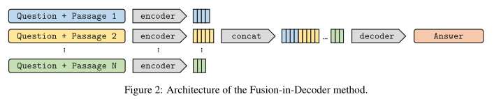
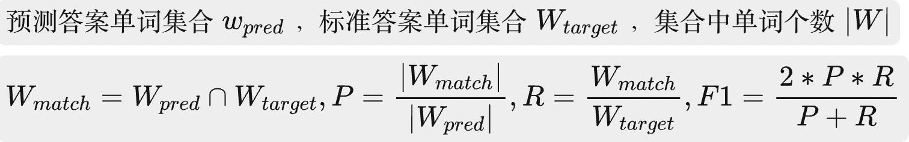
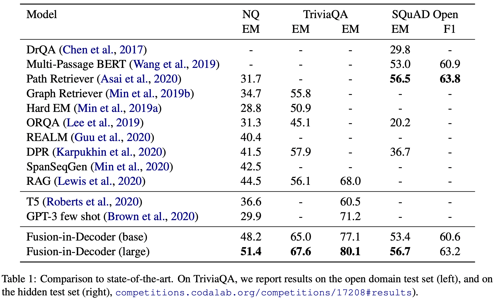
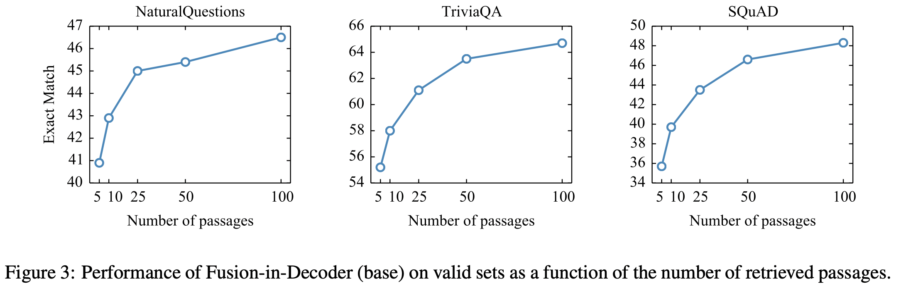
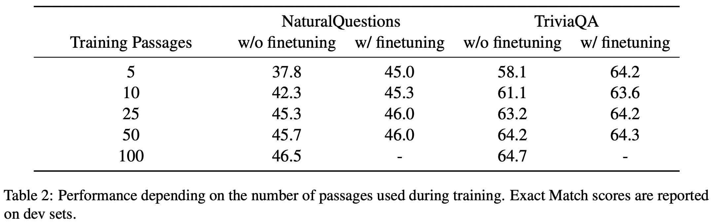

# Leveraging Passage Retrieval with Generative Models for Open Domain Question Answering
https://arxiv.org/abs/2007.01282

## 摘要
以往不足：开放领域问答的生成模型需要使用具有数十亿个参数的模型，这些参数对于训练和查询来说是非常重要的。 本文创新：研究了这些模型在检索可能包含证据的文本段落中能发挥多大的作用。 实验验证：我们在自然问题和 Triv-iaQA 开放基准测试中获得了最先进的结果。同时观察到，随着检索段落数量的增加，性能显著提高。

### 任务定义
检索器 R，生成器 G。输入为问题 q 和检索文档 p 的拼接，输出为生成的回答 y。

## 检索
检索器采用两种方法，BM25 和 DPR
1. 模型
    1. BM25：默认基础参数，并利用 SpaCy 对输入句子 tokenize。用于 SQuAD
    2. DPR：双塔BERT 网络计算问题向量和文档向量，然后余弦计算相似度。用于 NQ、TQA
2. 索引：FAISS 库构建近似最近邻索引

## 生成
使用 seq2seq 生成模型，220M 和 770M 的T5。模型输入为“question:q,title:t,context:p”。
1. Fusion-in-Decoder
    1. 编码器并行输入，得到输出，是问题+检索文档的表征向量
    2. 将多个表征向量拼接，得到所有检索文档的表征向量
    3. 将这个表征向量输入 decoder，得到生成的答案
2. decoder：greedy decoding

## 训练
在 open-QA 任务上进行实验和评估
1. 数据集
    1. NaturalQuestions+Wiki2018.12.20
    2. TriviaQA+Wiki2018.12.20
    3. SQuAD+Wiki2016.12.21
    4. 数据处理
        1. 训练集的 10% 用于验证集
        2. target y 处理
            1. NQ 和 SQuAD：从 answer 列表抽样
            2. TQA：用 py 的 title() 方法处理数据集 answer，就是开头大写
        3. Wikipedia 处理
            1. 预处理：删除半结构化数据，如表、信息框、列表以及消歧页面
            2. passage 化：然后将每篇文章分成多个不相交的 100 个单词的文本块，作为检索单元
            3. 标题连接：passage=title+[SEP]+passage
    5. 评估指标
        1. EM，生成的答案去标点、小写化、去重复空格、删除冠词之后，与标准答案对比
        2. F1 
2. 训练
    1. 检索 100 个 passage，然后拆分截断为 250 个单词片段
    2. 每个数据集上独立训练 T5

## 实验
|
表 1 1.表现优于现有的工作。 2.检索的段落，并行联合处理它们可以提高 RAG 准确性。 3.表明基于文本的外部记忆在知识检索任务中具有竞争力。  图 3 序列到序列模型擅长组合来自多个段落的信息。  表 2 减少检索文章数量会导致准确性降低
|  |
|-|-|

