

# Retrieval-Augmented Generation for Knowledge-Intensive NLP Tasks
https://arxiv.org/abs/2005.11401
1. Medium 博客：https://medium.com/@yeyuting0307/深入淺出rag經典論文-b57a4c29c65f
2. https://zhuanlan.zhihu.com/p/493577057

## 摘要
|
以往的不足：LLM 访问和精确操纵边际知识的能力有限。在知识密集型任务中，性能落后于特定任务的架构。此外，实时更新知识仍然是悬而未决的问题。  本文创新：探索了一种 RAG 的通用微调方案。比较了两种 RAG 范式，一种以整个生成序列使用相同的检索段落为条件，另一种可以为每个标记使用不同的段落。  实验验证：在三个 Open-QA 任务上设置实验，优于 seq2seq 模型和特定于任务的检索和提取架构。对于语言生成任务，RAG 模型生成的语言更具体、更多样、更真实。
|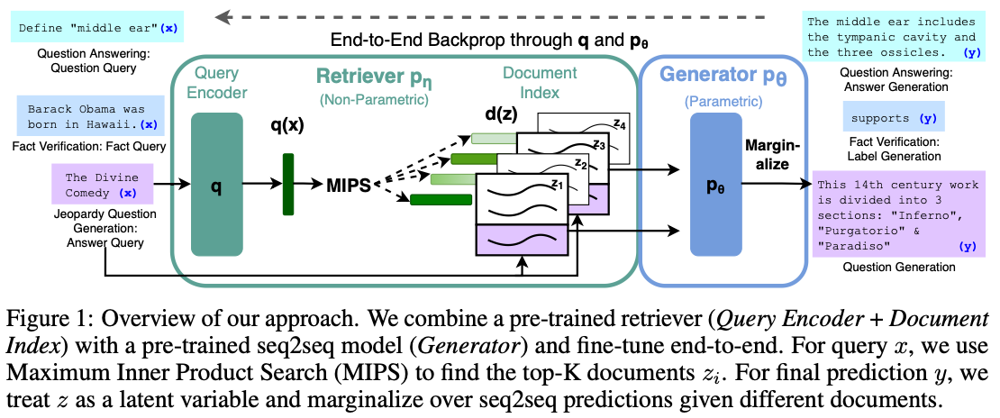|
|-|-|

### 任务定义
检索器 $p_\eta (z|x)$参数为$\eta$，基于输入 query x 检索 topk 截断的段落。生成器$p_\theta (y_i|x,z,y_{1:i-1})$生成基于输入 x、z 和历史生成$y_{1:i-1}$生成当前时刻的 token $y_i$。定义如下两种 RAG 范式：
1. RAG-Sequence：生成器生成 token 的知识均来自同一个检索段落 z。因此先为每个 z 生成一个 y 序列，然后求和得到最终生成的 y 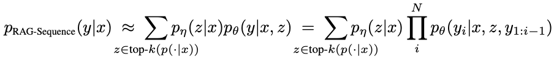
2. RAG-Token，生成器生成 token 的知识来自所有的检索段落 z1,...,zk。每时刻生成 token 都考虑所有 z 的知识，直接一步得到 y 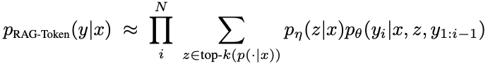

## 检索
1. 密集检索器 DPR，DPR 是一个双塔架构
    1. $p_\eta (z|x) \propto \exp(\rm{d}(z)^T\rm{q}(x))$，其中$\rm{d}(z)=BERT_d(z),\rm{q}(x)=BERT_q(x)$
    2. 使用预训练的 DPR 模型初始化文档索引
    3. 检索的文档是什么格式？？？passage？是什么样子呢？文中没描述
2. topk 的快速选择基于 MIPS，实现 sub-linear 时间
    1. 基于脸书的开源相似性搜索库 Faiss，论文 Billion-scale similarity search with gpus
    2. 一种用于 k-selection 的设计，以积量化（product quantization）为基础的暴力计算、近似和压缩域搜索提出优化设计。可在 GPU 上实现十亿规模级的相似性搜索

## 生成
任意 encoder-decoder 模型，使用 BART-large，400M 参数的预训练 seq2seq 模型。x 和检索段落 z，concatenate 起来送入生成模型。
1. 解码
    1. RAG-Token：可以看做标准的自回归 seq2seq 生成，标准 beam search 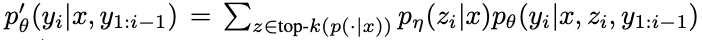
    2. RAG-Sequence：因为每个文档都生成一个序列，不能正常的 beam search 方式来解码
        1. 因此在每一个文档 z 上使用 beam search，这会产生一个序列集合 Y
        2. 针对每个生成序列，用其生成概率与$p_\eta (z|x)$点乘得到一个概率 score，取最大值对应的序列为最终输出
   
## 训练
1. 端到端非监督训练，不直接监督哪个文档应该被检索
    1. 固定检索器双塔中的 BERTd，仅训练 BERTq 和 BART
    2. 区别于 REALM，推测文档索引没有很强的效果
2. 基于输入输出对交叉熵损失训练模型，Adam

## 实验
针对四类下游任务进行实验，Open-QA、Abstractive-QA、Jeopardy-QG 和 Fact Verification。
1. Open-QA 开放领域问答任务
    1. 在四类数据集上实验：NaturalQuestions (NQ)、TriviaQA (TQA)、WebQuestions (WQ) 和 CuratedTrec (CT)，TQA 使用了两种不同的测试集
    2. 评价指标：Exact Match (EM)
2. Abstractive-QA：抽象问答任务，主要测试自然语言生成效果
    1. 数据集：MSMARCO NLG task v2.1
    2. 评价指标：EM？
3. Jeopardy-Question Gernation：评估在非 QA 任务下 RAG 系统的生成能力
    1. 数据集：SearchQA、
    2. 评价指标：SQuAD-tuned Q-BLEU-1 metric
    3. 两次真人评估：一次评估生成的真实性，一次进行特异性评估。评估人员会看到一个答案和两个生成的问题，一个来自BART，另一个来自RAG。然后，他们被要求从四个选项中选择一个——问题A更好，问题B更好，两者都好，或者两者都不好
4. Fact Verification：对于主张陈述，需要检索相关证据，并基于证据推理分类该主张是真实的、虚假的等
    1. 数据集：FEVER，基于维基百科分类是否支持、反驳或无法决定某自然语言声明
    2. 评价指标：分类常用的准确率、精准度

实验结果
|
1. open-QA 实现了 SOTA，而且没有昂贵的 MLM 预训练（REALM T5+SSM 有） 生成器和检索器都没达到最先进，但组合起来最先进  2. Abstractive-QA：实现了 SOTA，幻觉更少，更多样化（表 5）。表 3 是一些生成样例  3. Jeopardy Question Generation RAG-Token 最优秀。表 4 展示人类评估效果，RAG 的事实性鹤立鸡群。表 3 是一些样例 RAG-Token 生成效果分析（图 2），看到有些词从其他高相关文档生成  4. Fact Verification： 与 SOTA 相差一部分，但 RAG 对检索结果没有昂贵的监督训练 也评估了 RAG 检索文件是否与 FEVER 中注释为黄金证据的文件相对应。我们计算了RAG检索到的前k个文档和黄金证据注释之间的文章标题重叠。我们发现，在71%的情况下，检索到的顶部文档来自一篇金文章，在90%的情况下在检索到的前10篇文章中都有一篇金论文  5. 消融实验：表 6 ，检索能改善所有其他任务的结果，特别是对于开放域 QA。FVR 分类任务更关注实体  6. 检索文档数量与效果之间的关系：图 3
|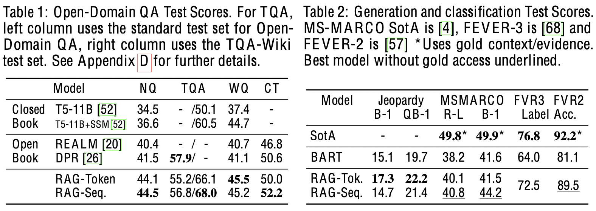 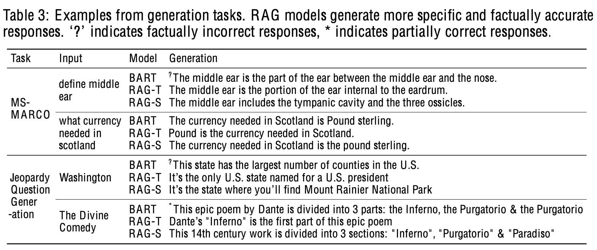 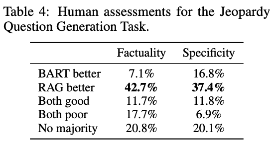 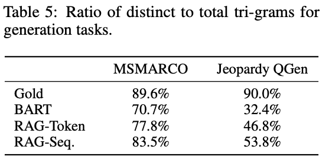 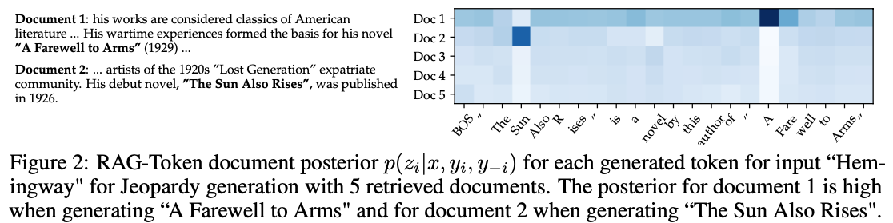 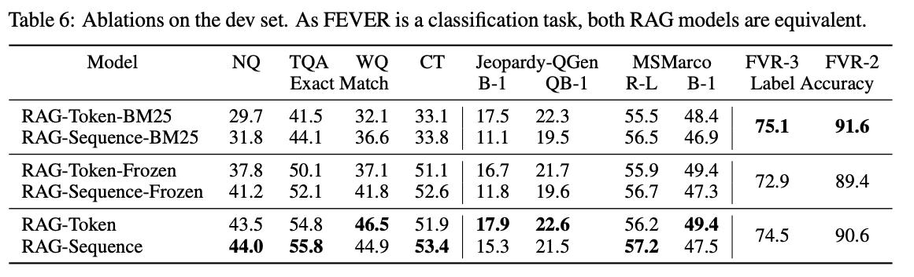 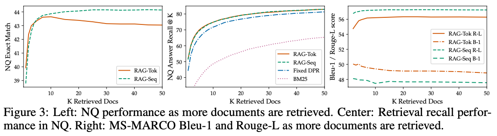|
|-|-|

