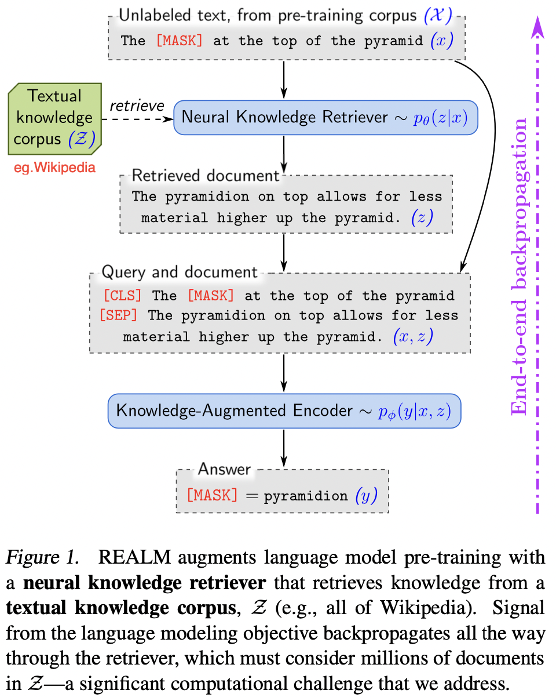
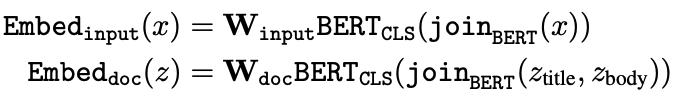
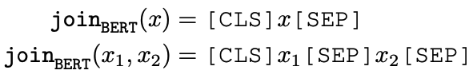
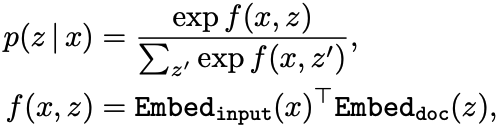
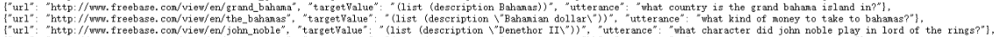
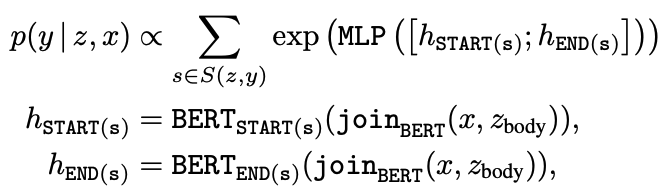
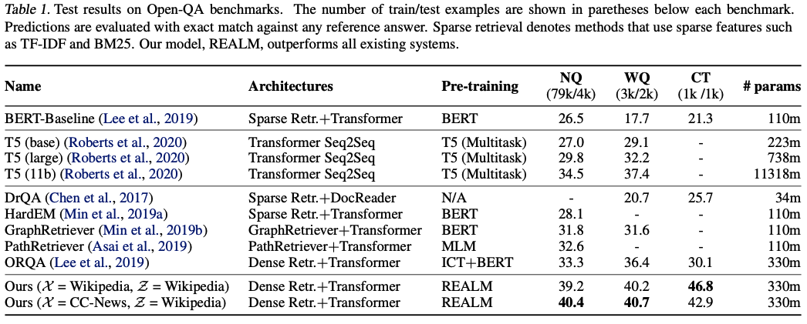
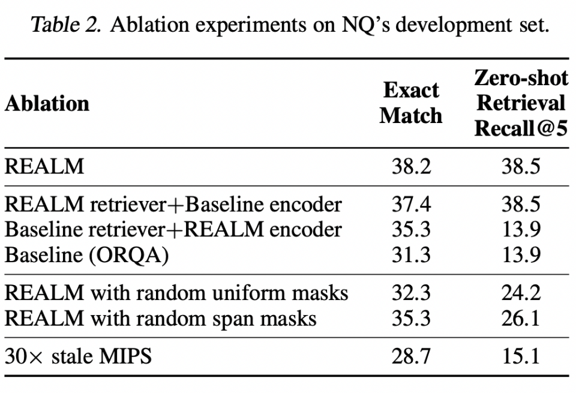

# REALM: Retrieval-Augmented Language Model Pre-Training
https://github.com/google-research/language/tree/master/language/realm
https://arxiv.org/abs/2002.08909

## 摘要
|
以往不足：LM 知识隐含地存储在神经网络的参数中，需要更大的网络来覆盖更多的事实。  本文创新：用知识检索器来增强语言模型预训练，首次展示以无监督的方式预先训练这样一个知识检索器。  具体内容：使用掩码语言模型作为学习信号，并通过考虑数百万文档的检索步骤进行反向传播。  实验验证：在三个流行的Open QA基准上与显式和隐式知识边缘存储的最新模型进行了比较，发现我们在很大程度上优于所有先前的方法（4-16%的绝对准确率），同时也提供了定性优势，如可解释性和模块化。
||
|-|-|

### 任务定义
输入问题设为 x，输出为 y，检索到的文档为 z，z' 视作数据库某文档。检索器参数设定为 $θ$，因此检索到的文档概率为 $p_θ(z|x)$。LM 输入 [CLS] x [SEP] z。设生成式模型参数为 $φ$，则 y 的概率为 $p_φ(y|x,z)$。

下游领域微调，设输出答案 y 是 z 中的一段 token 序列，即答案 y 是其中某个 span（将 QA 问题退化为阅读理解问题中片段抽取式回答）。p(y|z,x) 可以定义为如下公式。其中 S(z,y) 是 z 中匹配 y 的 span 集合，MLP 是线性层，$h_{START}(s)$和$h_{END}(s)$是答案 span 的开始和结束 token 对应的输出向量。考虑 top-5 检索结果。
## 检索
检索器模型结构 BERT+Liner layer。

1. 计算输入问题 $x$ 和知识库内部文档 $z'$ 的 embedding 向量
    1. Embedding 向量：$x$、$z'$ 分别输入 BERT，然后取到 [CLS] 对应的向量，再经过 $W$ 矩阵降纬得到 Embedding 向量  
    2. 相似性得分：先通过向量内积 $f(x,z)$ 计算 $x$ 与所有文档的内积，然后经过 $\rm{softmax}$ 得到相似度得分 
2. 基于向量和 MIPS 算法构建向量索引以便快速寻找 top k
    1. 考虑到不相关的文档 p(z|x) 都非常小，所以可忽略
    2. 在 RAG 系统训练的时候，检索器模型每 step 更新参数，但知识库索引间隔多 step 更新
3. 检索数据集
    1. 20181220 的英文 Wikipedia 快照
    2. 贪心的拆分为最多 288 个单词碎片的块 chunk

## 生成
生成器模型结构 BERT+Liner layer，生成模型概率公式 $p(y|x)=\sum_{z\in Z}p(y|z,x)p(z|x)$

## 训练
基于问答数据集，端到端预训练整个 RAG 模型，基于 MLM 损失优化模型损失。
1. 训练数据
    1. NaturalQuestions：每个样本有一个问题、一个长答案（全面的回答）和一个短答案（明确的短语）。有 307K 训练、8K 开发和 8K 测试数据
    2. WebQuestions：每个样本有一个自然问题、一个答案和一个 url（答案的段落页面）。3778 训练、2032 测试数据。基于 Freebase（类似 Wikipedia）  
    3. CuratedTrec：每个样本有一个问题和一个答案。共 867 条问答对
2. 评价指标：EM（精确匹配），模型生成的答案经过一些简单的去噪处理（删掉标点、去掉前后空格、全部最小化等），与标准答案一一匹配，如完全一致则为 1，否则为 0
3. 下游任务（开放问答中）微调
    1. 两两的将两个不同位置 $i,j$ 的隐藏层向量输入 MLP 层，得到该 span [i:j] 的表征向量，然后 softmax 归一化所有 span 的表征向量，得到 span 为答案 y 的概率
    2. 损失就是一个分类损失
    *  
  
## 实验

|
消融实验证明检索器训练非常重要。  额外的策略： 1.只 MASK 蕴含知识的词，如实体和日期 2.在 topk 之外添加了一个 null 文档 3.避免 x 出现在 z 中别人4.避免冷启动的 retriever 太渣导致的恶性循环，用一个以 ICT 作为任务的模型来初始化 retriever
| |
|-|-|

