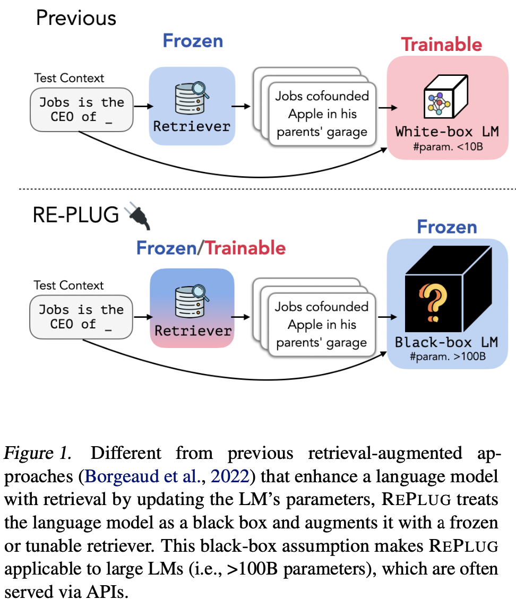
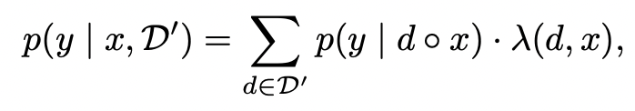
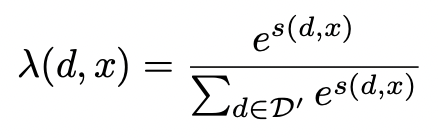
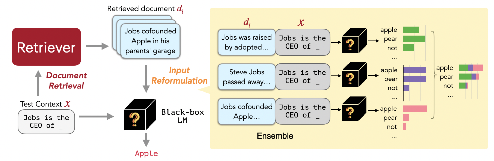
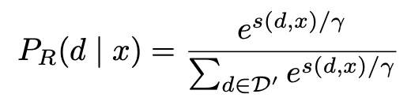
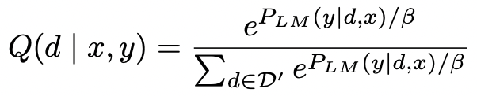
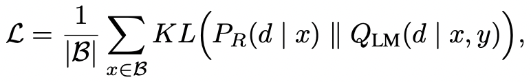
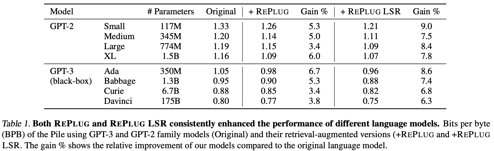
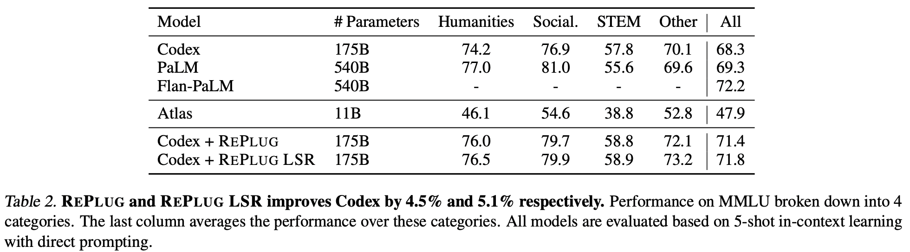
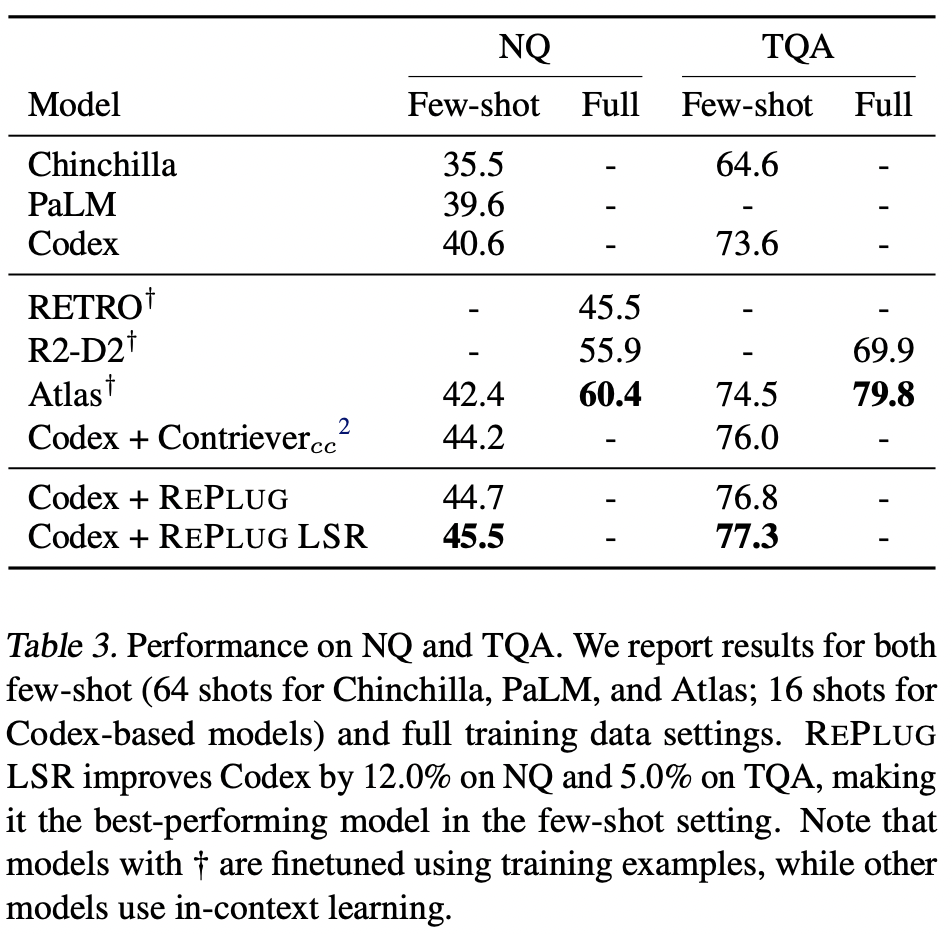

# REPLUG: Retrieval-Augmented Black-Box Language Models
https://arxiv.org/abs/2301.12652

## 摘要
| 
以往不足：无。  本文创新：REPLUG，将 LM 视为一个黑盒，并用一个可训练的检索模型对其进行增强。使用特殊的交叉注意力机制训练语言模型来对检索到的文本进行编码。  具体内容：REPLUG 将检索到的文档添加到冻结黑框 LM 输入中，简单的设计可以很容易地应用于任何现有的检索和语言模型。  实验验证：证明了 LM 可用于监督检索模型，检索模型可以找到有助于LM做出更好预测的文档。我们的实验表明，使用微调检索器的 REPLUG 显著提高了 GPT-3（175B）在语言建模方面的性能 6.3%，以及Codex在五镜头 MMLU 上的性能5.1%。
 | |
|-|-|

### 任务定义
给定输入文本 $x$，检索器 $R$ 从额外知识库 $\mathcal{D}=\{d1,...,d_m\}$ 检索相关文档。对于每一个检索到的文档，先和输入 concatenation，再通过 LM 生成答案。生成过程对于检索到的文档来说是并行的。

## 检索
检索器 $R$ 是双塔 encoder 架构，Contriever 模型。对于知识库 $\mathcal{D}=\{d1,...,d_m\}$ 中的文档 $d$，将其输入双塔模型得到向量 $\rm E(d)$。输入文本 $x$ 经过同样处理得到 $\rm E(x)$，二者相似度为向量余弦值 $s(d,x)=\rm{cos}(\rm E(d),\rm E(x))$。为了高效检索 topk 文档，使用 FAISS 算法构建向量索引。

## 生成
**（这是只输出一个 token 概率，那么生成连续 token？？）**
1. 推理阶段
    1. 假设 $\mathcal{D'}\subset \mathcal{D}$ 包含最相关的 topk 文档，相似性得分 $s(d,x)$
    2. 每个 $d$ 分别添加到 $x$ 前面，然后丢入 LM，并行的得到 $k$ 个下一个 token 的概率 $p(y|d\circ x)$
    3. 然后将 $k$ 个概率求加权平均值，得到最终的该生成 token 概率 $p(y|x, \mathcal{D'})$
    4. 第 $i$ 个加权平均的权重系数 $\lambda(d,x)$，就是第 $i$ 个文档和 $x$ 的相关性得分的归一化概率
    5.     

## 训练
1. 训练数据
    1. $\{x,y\}$
        1. 800K 个 256 token 的序列作为训练 query，来自 Pile training data
        2. 每个 query 分为两个 128 的部分。前一个 128 用作输入 $x$，后一个用作生成 GT 标签 $y$
    2. $\mathcal{D}$
        1. 抽样了 36M 个 128 token 的文档，来自 Pile training data
        2. 确保 $\mathcal{D}$ 中文档不会与训练 query 重叠
2. 检索器训练 REPLUG LSP
    1. 利用 LM（GPT-3 Curie） 监督检索器训练，让检索可以减少 LM 的困惑度的文档
    2. 训练步骤
        1. 计算检索文档 d 的概率 $P_R(d|x)$，$\lambda$ 是温度系数，上述概率其实是近似概率因为只计算 topk  
        2. 计算 LM 概率对于 d 的概率（**亦或是得分更准确**）
            1. LM 用于评估每个文档 $d$ 能提高多少
            2. 首先，计算 $P_{LM}(y|d,x)$。即 $d+x$ 输入 LM 得到的输出序列中，GT 对应的概率
            3. 然后，softmax 得到归一化概率 $Q_{LM}(d|x,y)$，其中 $\beta$ 是温度系数  
        3. 计算 KL 损失
            1. 输入 $x$，真实值 $y$，检索器通过减少 KL 损失去训练
            2. $\mathcal L$ 是损失，$\mathcal B$ 是输入 $x$ 的集合。训练中 LM 参数是固定的  
        4. 异步更新文档 index，每 $T$ 个训练步长更新一次 
    * 
    4. 训练参数设定
        1. 预先计算文档 embedding 向量，并建立 FAISS 索引
        2. 对与输入 x，使用温度系数 0.1 去检索 top-20 文档
        3. 训练模型，Adam，lr=2e-5，bs=64，warmup=0.1，每 3k step 更新一下文档索引，共训练 25k step

## 实验
在三个下游任务上进行了评估实验。
1. LM
    1. 数据集：Pile，来自网页、论文和代码等文本源
    2. 评价指标：$BPB=(L_T/L_B)\log_2(e^\mathcal L)=(L_T/L_B)\mathcal L/\ln 2$；$L_T$代表token长度，$L_B$代表字节长度
    * 
2. MMLU
    1. 数据集：Massive Multi-task Language Understanding，多选的 QA 数据集，来自 57 个任务并分为四个类别 humani- ties、STEM、social sciences and other
    2. 评价指标：5-shot in-context
    * 
3. Open-QA
    1. 数据集：Natural Questions、TriviaQA
    2. 评价指标：EM？？
    * 
4. 分析。。。