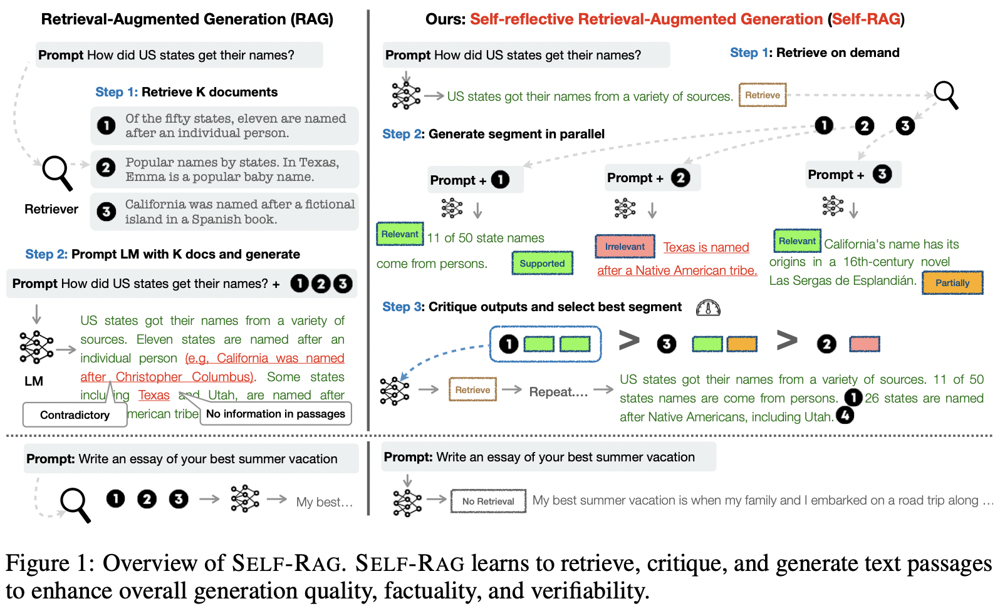
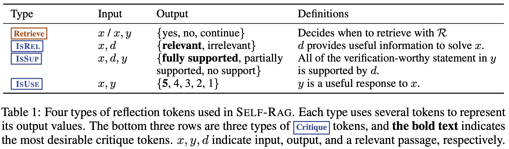
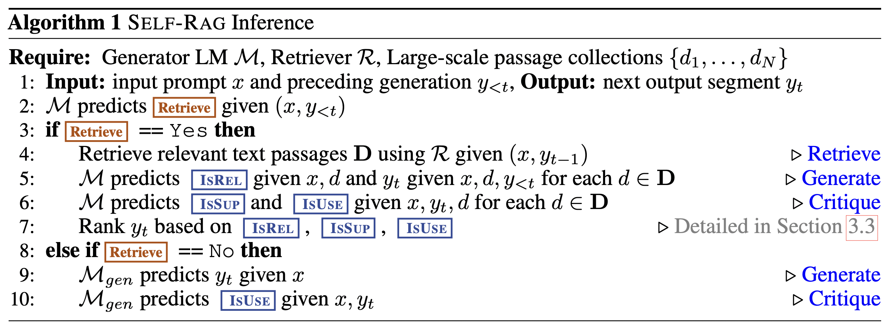
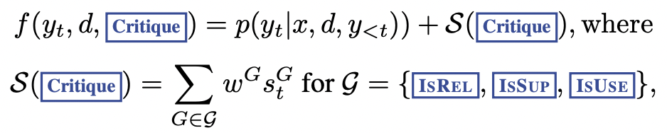
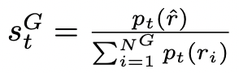
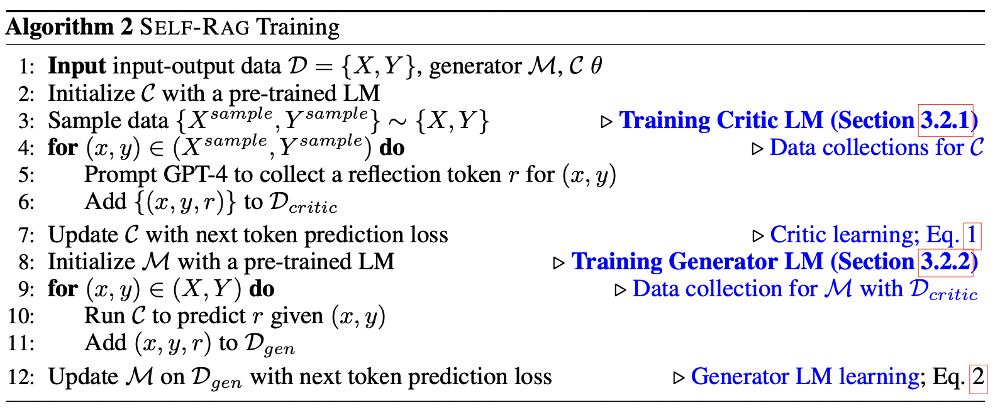
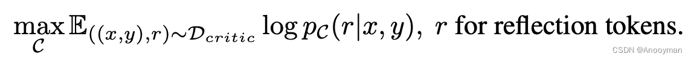
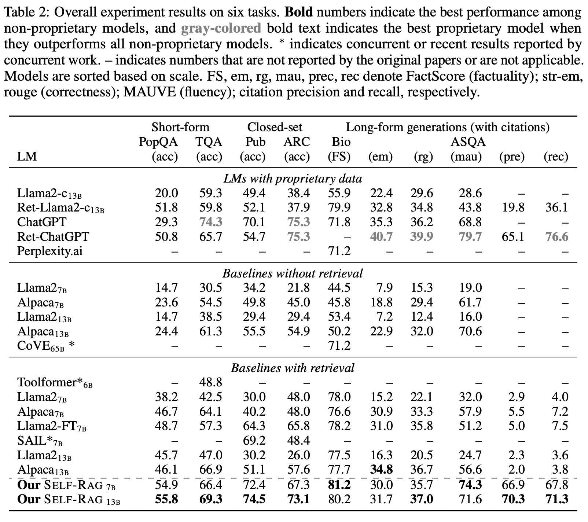
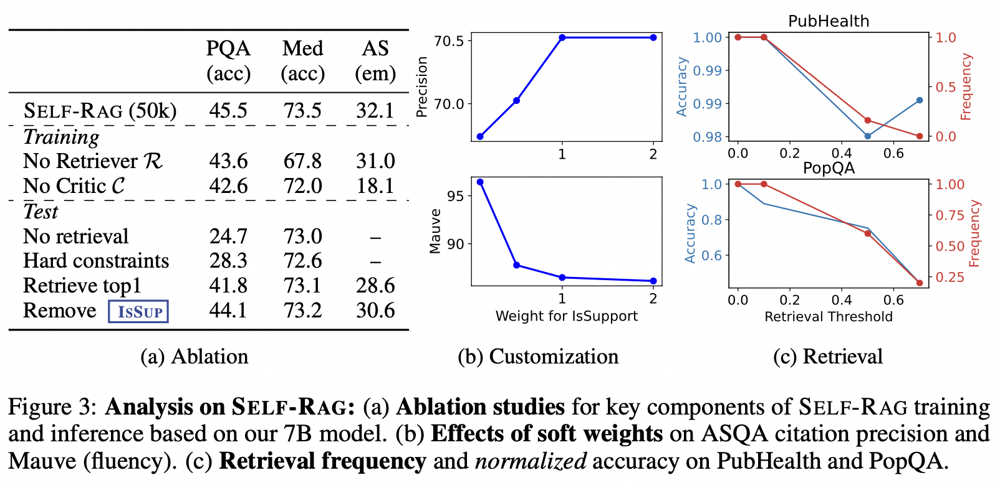

# SELF-RAG: LEARNING TO RETRIEVE, GENERATE, AND CRITIQUE THROUGH SELF-REFLECTION
https://arxiv.org/abs/2310.11511 \
https://github.com/AkariAsai/self-rag

## 摘要
|
以往的不足：不关注检索的结果是否相关、必要，检索结果可能降低 LM 能力甚至负导向的生成。  创新点：本文提出 SELF-RAG，通过检索和 self-reflection 增强 LM 的质量和事实性。  具体内容：训练一个单独的 arbitrary LM，自适应的按需检索 passage。aLM 基于对 passage 生成的 special token 去自适应。
||
|-|-|

### 任务定义

|
给定输入$x$，大规模知识库$\rm{passage}=\{d_1,...,d_N\}$，检索器$R$，训练生成器模型$M$连续的输出文本$y=[y_1,...,y_T]$。其中$y_t$是 token 序列构成的文本片段，其 token 来自原始词表和 reflection tokens。
||
|-|-|

## 检索
1. 检索器 R 使用现成的 Contriever 模型，在 MS MARCO 上微调，对于每个输入检索 top5 结果
2. passage：推测是按照以往论文常用的方法，约定俗成了

## 生成
|
1. $M$和$M_{gen}$是两个单独的模型   2. 第5、6行中，$M$对于每个检索的$d$都进行生成，因此并行的生成  3. 迭代的生成直到$\rm{Retrieve=No}$
|  |
|:-|:-|

1. 生成模型使用 Llama2 7B|13B，评论模型使用 Llama2 7B
2. 推理阶段
    1. 按需推理，如果要求实事性则更多的检索（降低特殊 token $\rm{Retrieve}$的阈值），反之在开发回答任务可以减少检索需求
    2. Tree-decoder
        1. 在阶段 t，对于第 k 个检索到的 passage，使用$beam size=B$的搜索，并最后返回最优
        2. 在第$t$阶段，共有$K$个检索的 passage，生成器$M$并行处理得到$K$个连续输出
        3. 在阶段 t 中，$y_t$相对于每个检索到的 d 有一个得分$S$，$S$是三类 Critique token 概率的线性加权和。设$G$是 token group，$S=s_t^G$，则计算如下 
            *  
            * 超参数$w^G$可以控制三类 token 的权重，从而实现个性化

## 训练
|
评论模型$C$基于检索到的 passage 预测 reflection tokens，用于评估检索到的 passage 和任务输出的质量（？？？）。reflection tokens 和检索数据一起用于生成模型$G$的训练。然后训练生成模型$G$，确保生成模型可以自行生成 reflection token。因此首先需要构造可监督数据集，去训练评论模型$C$和生成模型$G$。
||
|-|-|

1. 构造评论模型数据集$D_{cirtic}$
    1. 人工是昂贵的，因此利用 prompt 工程在 GPT4 里面生成可监督的数据集，然后蒸馏知识到评论模型$C$
    2. 不同 reflection token 的数据集，先随机抽样构造$\{X^{sample},Y^{sample}\}$，然后使用不同的提示指令生成 reflection token。人工验证结果
    3. 每类 reflection token 收集了 4k-20k 监督训练数据
2. 评论模型$C$训练
    1. next token predict loss 训练评论模型 
    2. 最终效果比 GPT4 高 90%
3. 构造生成模型数据集$D_{gen}$：基于检索的文档、评论模型$C$和输入输出对$(x,y)$
    1. 对于文本片段$y_t$，$C$先预测是否需要检索，输入为 x 或者 $x,y_{t-1}$（即 $\rm{Retrieve=Yes}$）
    2. 如果要检索，并令$R$检索 topk $D$。然后对于检索的每个 passage，$C$预测与$x$的相关性（即 token $\rm{IsREL=?}$）
    3. 对于相关的 passage，$C$预测该 passage 是否对答案启支撑的作用（即 token $\rm{IsSUP=?}$）
    4. 将最优检索结果$\rm{IsSUP=?},\rm{IsREL=?}$被追加到检索或者生成结果 $y_t$ 之后
    5. 进入下一个文本片段 $y_{t+1}$ 的生成，迭代到模型生成 END
    6. 在输出最终的 $y_T$ 之后，$C$预测$\rm{IsUSE}$ token。然后，上述数据追加到数据集$D_{gen}$，数据集新增一条数据
4. 生成模型$G$训练
    1. 不仅仅生成$y_t$，也要生成 reflection token，标准 next token preidct loss
    2. 词表要扩充几个特殊 token。loss mask 检索到的 passage（不希望梯度传到这）

## 实验
数据集，在三个任务上对 Self-RAG 进行了实验
* 封闭集合任务
    * PubHealth：公共卫生，事实验证数据集
    * ARC-Challenge：从科学考试中创建的多项选择，推理数据集
    * 评估：准确率 accuracy
* 简短生成任务
    * PopQA：开放领域QA，使用长尾子集
    * TriviaQA-unfiltered：QA，需要验证和拆分一下
    * 评估：是否包含 gold 答案来评估，不是严格的 EM
* 长生成任务
    * 传记生成：Min et al., 2023
    * FactScore 评估
    * ALCE-ASQA：QA任务
        * 评估 official metrics of correctness (str-em)
        * 评估 citation precision and recall 

**结果和分析**
|
实验效果都是较好的。   消融实验表明所有组件都发挥着重要作用。 1.Self-RAG 和无检索器或Critic基线之间存在较大的性能差距，这表明用这些模型训练 LM 在很大程度上有助于 Self-RAG 的性能提升。 2.使用与相关性（Retrieve top1）相关的顶部评估作为传统 RAG 方法会导致 PopQA 和 ASQA 的性能。这证明了 Self-RAG 仔细选择基于细粒度多标准的迭代能力的有效性，而不是天真地使用检索模型中的所有 top 段落。
| |
|-|-|

