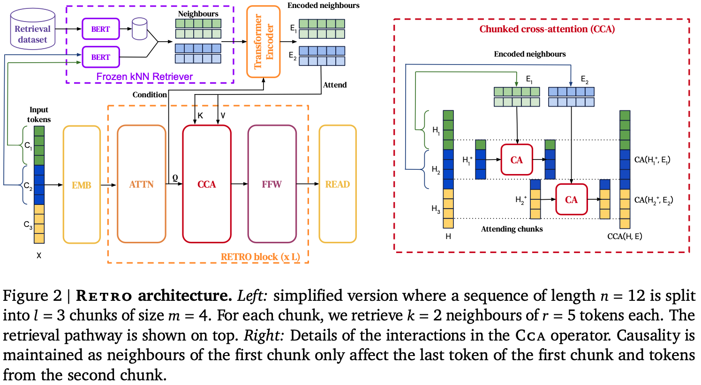
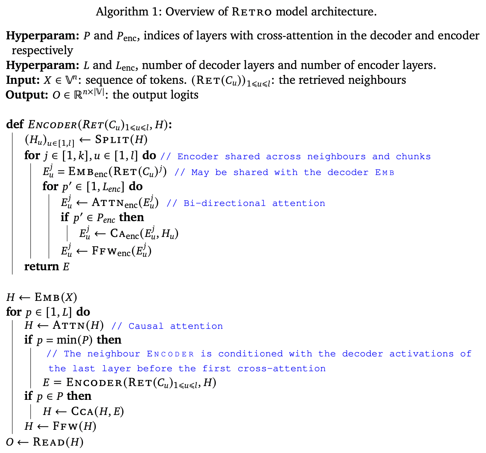
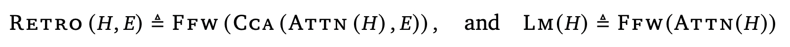
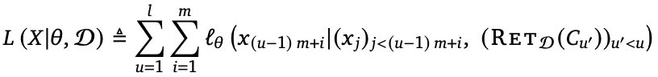
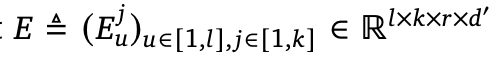
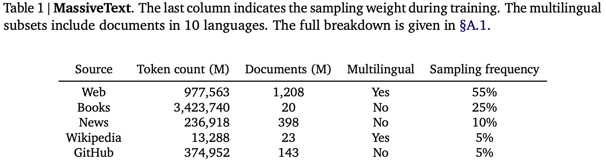

# Improving language models by retrieving from trillions of tokens
https://arxiv.org/pdf/2112.04426
https://www.cnblogs.com/Matrix_Yao/p/16480698.html

## 摘要
本文创新：基于局部相似性对检索到的文档块进行条件处理来增强 LLM 模型。 
具体内容：Retro 结合了冻结的 Bert 检索器、可训练编码器和分块交叉注意力机制，根据比训练期间通常消耗的数据多一个数量级的数据来预测令牌。我们通常从头开始训练 Retro，但也可以通过检索快速改装预训练的 Transformer。 
实验验证：Retro 在 Pile 上获得了与 GPT-3、Jurassic-1 相当的性能，但参数减少了 25 倍。

### 任务定义
k-v 数据库 $\mathcal{D}$，v 存储 chunk 的 token，k 存储 BERT 编码后的向量。词汇表 $\mathbb{V}=[1,v]$ 共有 v 个 token。对于一个样本 $X=(x_1,...,x_n)$ 每 m 个 token 拆分为一组，得到 l 个 chunk $(C_1,...,C_l)$，其中 $m=n/l$。使用 n=2048 和 m=64。使用检索器从 $\mathcal{D}$ 中检索与 $C_u$ 最相近的 k 个 chunk，这个操作视作 $\rm{RET}_\mathcal{D}(C_u)$，用来增强 $C_u$。生成模型参数 $\theta$，将检索到的 chunk 和检索 query 都作为输入，生成最终答案 $y$。

## 检索
检索器模型使用 BERT，双塔结构，其中一个输入 X 的块，另一个输入数据库中 v 的 N。并基于 SCaNN 构造向量索引。
1. kv 数据库
    1. v=[N,F]，N 是该 chunk 的句子，F 是 N 的后续句子
    2. k=BERT(N)，N 和 F 的长度是 64
    3. 防止自回归性质被破坏
        1. 即 $C_{u+1}$ 在集合 $\rm{RET}(C_u)$ 里面
        2. 过滤掉与训练序列 X 来自同一文档的邻居
2. 寻找 topk
    1. 定义 topk 集合为 $\rm{RET}(C)\sim ([N^1,F^1],...,[N^k,F^k])$
    2. 使用 L2 距离计算每个 chunk $C$ 的 topk 邻居
    3. 但是 $\rm{RET}(C_1)=\empty$，即第一个块不决定与任何检索数据
3. 索引构建 SCaNN
    1. 10 ms 能查完数据库，但还是太慢
    2. 冻结 BERT，预先计算所有 kv 库中块的编码，并存储

## 生成
生成模型使用 encoder-decoder 的 transformer 结构。首先，$\rm{RET}(C)$ 输入一个 encoder 得到编码的邻居集合 $E$。定义输入 X 的编码为 $H$。decoder 然后会计算 $\rm{RETRO}(H,E)$ 和 $\rm{LM}(H)$。 
1. $\rm{RETRO}(H,E)$：其中 $\rm{FFW}$ 是全连接层，$\rm{ATTN}$ 是标准自注意层，$\rm{CCA}$ 是块交叉注意力层 
2. 损失计算
    1. 上述输出的编码向量，输入一个 token 分类头，得到自回归的输出结果
    2. 损失如图， 
3. encoder 计算 $E$
    1. 对于 $C_u$ 的 topk 集合 $\rm{RET}(C_u)$，输入一个双向编码器，得到 $E^j_u\sim \rm{ENCODER}(\rm{RET}(C_u)^j,H_u)$。其中 j 是第 j 个邻居
    2. 所有文档的编码计算是并行的，然后通过全连接层得到最终的 $E$ 
4. Chunked cross-attention
    1. 

## 训练
数据集使用多语言版本 MassiveText
1. 训练
    1. 数据集里面抽样
    2. 使用 SentencePiece 对数据集做词表映射，词汇表大小为 128000 token
2. kv 数据库
    1. 训练：与训练数据由同样的子集构成，比例与采样频率相同
    2. 评估：1.75T token
3. 防止数据泄露
    1. 基于 MinHash 架构计算 train 和 test 文档的 13-gram Jaccard 相似度，移除 0.8 及其以上的训练集文档
    2. 从维基百科训练数据中删除了 Wikitext103 中的所有验证和测试文章
4. 评估：使用 Web、News、Wikipedia、GitHub 全部数据，以及 Books 的 4% 子样本
* 